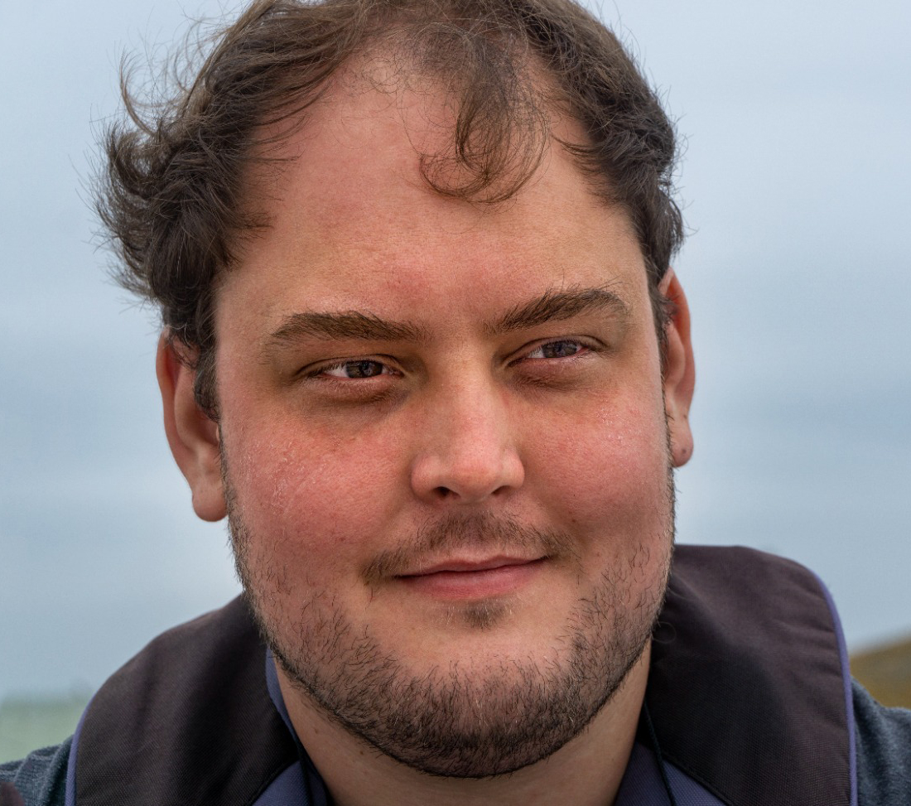

# Damian Zaremba

\Begin{multicols}{2}

{width=300px}

I am an experienced professional with a background in IT systems/network engineering & PADI/TecRec/EFR training.

Previously I have been a climbing instructor for the scout association, maintainer of anti-vandalism services for Wikipedia,
a volunteer at conferences & a business owner.

In addition, I have worked on infrastructure for organisations ranging from lean start-ups to multi-billion dollar public companies.

My curious nature & desire for knowledge results in ongoing learning & advancement of existing ratings, incrementally improving my valuable skillset.

I am currently looking for a PADI 5-star centre with IDC/Tec Rec accreditation that can support taking my professional diving to the next level.

\End{multicols}

\vspace{-20px}

# Work Experience

\Begin{multicols}{2}

## Scuba Education Amsterdam\vspace{-5px}
### Staff / Divemaster / Instructor\vspace{-5px}
*2018 - present*\vspace{-5px}

SEA is a busy 5-star PADI resort & PADI TecRec centre located in Amsterdam, the Netherlands.

Starting as a Divemaster candidate, I became intimately familiar with the centre operations throughout my internship.

After achieving my Divemaster rating, I stepped up as the right-hand man, taking on direct responsibilities for the day-to-day running of the dive centre.

Since achieving my instructor ratings, I provide in-classroom & in-water training for PADI/TecRec/EFR courses.

General responsibilities include:

* Opening/closing of the dive centre
* Greeting/orientating new students
* Operation of the filling station
* Equipment repair/servicing
* Organisation of student training
* Management of staff (DM/AI)
* Reviewing/remediating theoretics
* Delivery of knowledge development material
* Preparation of classroom/pool for training
* Organisation & transportation of equipment
* In-water teaching, evaluation & supervision
* PADI & internal paperwork completion & review
* Issuing certifications via PIC online

Additional responsibilities include:

* Assisting with events in the associated diving club
* Providing surface/diver support during technical dives
* Acting as a certified assistant during technical training
* Providing in-water assistance for local events

$\columnbreak$

## Fastly\vspace{-5px}
### Senior Network Engineer\vspace{-5px}
*2018 - 2021*\vspace{-5px}

Fastly is a leading cloud computing services provider.

As part of the Network Reliability Team, I worked on multiple cross-functional projects,
delivering complex technical solutions powering world-leading customers.

During this time, the company completed an IPO and more than tripled its global capacity.

Key customers included FOX Sports/CBS interactive (Super Bowl), ByteDance (TikTok), Amazon.com, BAMTech (Disney+), Sony IE (PlayStation network), Paypal & Spotify.

## Booking.com\vspace{-5px}
### Network Engineer\vspace{-5px}
*2016 - 2018*\vspace{-5px}

Booking.com is a leading online travel agency.

As part of the Internet Team, I worked on delivering internet connectivity for 18k+ internal colleagues,
as well as infrastructure serving 1.5+ million bookings per day.

During this time, there was a complete hardware refresh with numerous tooling initiatives.

Both day-to-day operations & key infrastructure upgrades required significant collaboration with other internal teams,
delivering significant capacity & performance improvements to an aggressively growing business.

\End{multicols}

\newpage

# Diving experience

Over the last four years, I have logged more than 300 dives across multiple countries
ranging from beautiful tropical & sub-tropical destinations including Thailand, Mexico, Egypt & Tenerife,
to the cooler northern climates, including Iceland, Germany & the Netherlands.

The wide range of diving locations & opportunities has enabled me to advance
my skills & knowledge, achieving many certifications along the way
including Tec Rec & professional ratings.

After assisting with more than 150 students & personally certifying more than 30,
one of the best rewards is watching others grow, achieve new things & have their own experiences.

With northern Europe offering cold water diving all year,
I have significant experience with diving & managing students in challenging conditions,
including dark/turbid waters & extensive dry-suit diving.

# Current certifications

\Begin{multicols}{2}

### PADI core credentials

* Master Scuba Diver Trainer
* Open Water Scuba Instructor
* Divemaster

### PADI TecRec credentials

* Tec Rec Trimix Blender Instructor
* Tec Rec Deep Diver (certified assistant)

### EFR credentials

* EFR Instructor
* Care for Children w/AED Instructor

\Begin{vfill}{}\End{vfill}
$\columnbreak$

### PADI speciality credentials

* Enriched Air Instructor
* Deep Instructor
* Night Diver Instructor
* Drift Instructor
* Dry Suit Instructor
* Boat Instructor
* Diver Propulsion Vehicle Instructor
* Underwater Navigator Instructor
* Search & Recovery Instructor
* Delayed Surface Marker Buoy Instructor
* Wreck Instructor
* Self-Reliant Instructor
* Peak Performance Buoyancy Instructor
* Project Aware Instructor
* AWARE Coral Reef Conservation Sp Instructor

\End{multicols}

\vspace{-20px}
### Yacht certifications

* Shorebased RYA/MCA Day Skipper for Sail & Power Craft
* Shorebased RYA/MCA Coastal Skipper & Yachtmaster Offshore
* RYA Competent Crew
* RYA Level 2 Powerboat Handling

### Additional training

* Human factors in diving: the essentials

# Additional information

\Begin{multicols}{2}

### Insurance

* DAN Pro PADI dive accident insurance
* DAN Pro PADI liability insurance
* Personal health insurance (CZ)

### Miscellaneous

* Netherlands company registration
* Own equipment (recreational, technical & mCCR)
* Renewed 2021 instructor

### Travel

* United Kingdom passport
* Netherlands (EU) residence permit (unrestricted)
* Netherlands (EU) driving license (AM/B/T)

### Contact

* Email: [damian@divewithdamian.eu](mailto:damian@divewithdamian.eu)
* Whatsapp: [+31 6 829 62098](https://wa.me/0031682962098)

\End{multicols}
