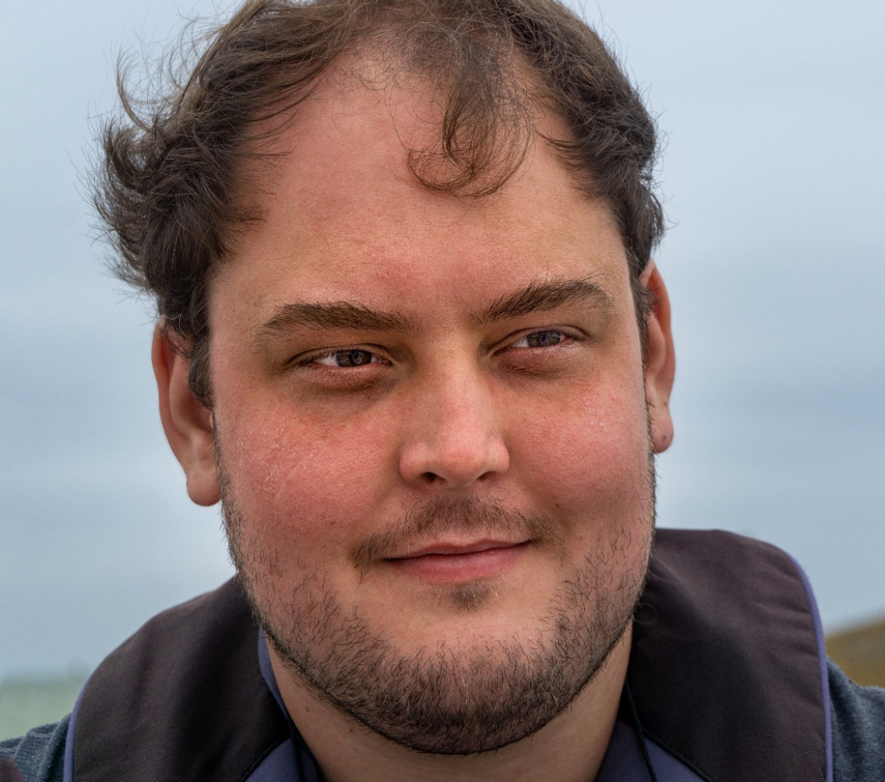

# Damian Zaremba

\Begin{multicols}{2}

{width=200px}

I am a passionate RYA Yachtmaster Instructor (sail) with a track record of delivering high-quality training.

Having worked within the same sailing area for a couple of years I am seeking new opportunities as an instructor and master.

Nationality: British, Resident: Netherlands, Languages: English (Native), Netherlands (A2)
Email: [damian@sailingwithdamian.eu](mailto:damian@sailingwithdamian.eu), Phone: [+31 6829 62098](tel:0031682962098)

\End{multicols}

\Begin{multicols}{2}

## Certificates

- Yachtmaster Instructor for Sail (april 2028)
- Commercially endorsed Powerboat Level 2 & Yachtmaster Offshore (aug 2027)
- STCW Elementary First Aid (may 2027)
- STCW Personal Survival Techniques (july 2027)
- ENG1 (aug 2026)
- RYA diesel engine, RADAR, DS/YM shorebased

$\columnbreak$

## On the water experience

- ~15k nm (sail) since 2017, mostly in tidal waters
- ~6k nm single-handed (sail), mix of coastal and multi-day offshore/ocean passages
- \> 300 days seagoing service (~6k nm)
- \> 100 RYA certificates issued
- \> 20 exam candidate passes (vast majority at offshore level)

\End{multicols}

\vspace{-35px}
## Technical experience

- Diesel engines (especially volvo D1/D2 series) troubleshooting & servicing
- Navigational electronics (especially Raymarine), including NMEA 018/2000 (bridging/inter-op, decoding)
- Electrical 12/240 volt systems including multi-bank systems and different charging/inverting/earthing arrangements
- Rigging inspection/tuning (especially fractional/linked standing & running rigging)
- Mechanical installation and inspection (e.g. steering linkage, motors, vane gear, stanchion/chain plate/deck joints)
- General maintenance e.g. GRP repairs, thru-hull replacements, anti-fouling, whipping, splicing

\vspace{-10px}
# Maritime Work Experience
\vspace{-10px}
\Begin{multicols}{2}

## Senior Yachtmaster Instructor\vspace{-5px}
### Canary Sail SL\vspace{-5px}
*April 2024 - April 2025*\vspace{-5px}

- Successfully completed 10 exam preparation weeks with a > 90% candidate success rate
- Excellent feedback received from clients
- Developed internal training material and supported the growth of new instructors

$\columnbreak$

## Yachtmaster Instructor\vspace{-5px}
### Canary Sail SL\vspace{-5px}
*April 2023 - April 2024*\vspace{-5px}

- Delivered high quality training, focusing on RYA Coastal Skipper and (pre-exam) skill development
- Produced internal training material (pole tri-angulation, storm-sail rigging, practical radar demonstrations etc)
- Handled numerous technical issues with a safety focus

\End{multicols}
\vspace{-15px}
\Begin{multicols}{2}

## Freelance Skipper\vspace{-5px}
### Various\vspace{-5px}
*August 2022 - present*\vspace{-5px}

- RIB operations (primarily scuba diving)
- Boat delivery/relocation
- Boat care (including organisation of maintenance & delivery to/from hard standing)

$\columnbreak$

## Cruising Instructor\vspace{-5px}
### Canary Sail SL\vspace{-5px}
*December 2022 - April 2023*\vspace{-5px}

- Worked on average 3 (6 day) weeks per month deliverying RYA Day Skipper/Competent Crew & skill development weeks
- Strong emphasis on safety, delivering detailed feedback on defects
- Consistent positive feedback from clients

\End{multicols}

\vspace{-30px}
# Other Work Experience
\vspace{-10px}
\Begin{multicols}{2}

## Diving/First Aid Instructor\vspace{-5px}
### Freelance\vspace{-5px}
*October 2020 - present*\vspace{-5px}

- Hold IDC Staff/Tec Rec Deep Instructor & Emergency First Response Instructor Trainer ratings
- Successfully completed 5 Instructor Development Courses & achieved 20+ speciality instructor ratings.
- 500+ dives including cold water dry suit (NL/DE), tropical (TH/MX) & technical (ES/EG)

$\columnbreak$

## Systems/Network Engineer\vspace{-5px}
### Freelance/Contract\vspace{-5px}
*October 2018 - present*\vspace{-5px}

- Reduced operational overhead through tooling and process improvements
- Developed technical designs to meet business requirements
- Improved performance and redundancy of solutions

\End{multicols}

\newpage

\Begin{multicols}{2}

Prior to 2016 I have held numerous technology related positions including

- Network Engineer
- Principal Security Engineer
- Technical Architect
- (Senior/Lead) Systems Engineer/Administrator
- Software Engineer/Developer

$\columnbreak$

I have also held numerous volunteer positions including

- General / Video volunteer - FOSDEM
- Assistant Scout Leader / Climbing Instructor - Scout Association
- Council member - ClueNet

\End{multicols}

\vspace{-30px}
# My sailing background

While I started out in the mid 2000s with dinghy sailing in the UK, it wasn't until after moving to the Netherlands in 2016 opportunities to sail yachts aligned with my interest.

Between 2017 and 2021 I managed to sail around 3k miles, mostly on short casual trips around the inland and coastal waters of the Netherlands.

With a plan to have a break from IT (having just completed an IPO combined with COVID-19 related growth/restrictions), I started down the RYA path gaining CC/PB2/SRC & DS shorebased as the first step.

In late 2021 - upon ending a contract - I managed to purchase my own boat and started sailing longer distances, with an initial 'year off' plan, mostly building experience through mistakes and occasional courses.

After sailing another ~5k miles down europe, diving into all aspects of maintenance, theory, planning and general boat life, I ticked off CS & YM shorebased.

With a view to keeping my own skills fresh, furthur diversity income and a job opportunity on the table, I passed the YMO and CI courses, starting to work and improve as an instructor.

Definitely and un-planned and somewhat unconventional route!

# "Notable" passages

### 2021 / 2022

- Bruinisse (NL) -> Schiedam (NL) -> Amsterdam (NL) - Short handed, NL coast, delivery from broker - 

- Scheveningen (NL) -> Cherbourg (FR) - Single handed, english channel - 
- Cherbourg (FR) -> Brest (FR) -> La Coruna (ES) - Single handed, winter biscay crossing - 
- La Coruna (ES) -> Baiona (ES) -> Cascais (PT) - Single handed, EU coast - 
- Cascais (PT) -> Maderia (PT) -> Tenerife (ES) - Single handed, ocean - 

- General cruising along the European west coast
- General cruising around the western Canary islands also working along the coast in RIBs for numerous diving centers.

### 2023 / 2024

Cruising and working in the Canary islands, covering numerous routes between the islands.

Some favorite passages, a mixture of single/short handed and crewed:

- Garachico (Tenerife) -> Santa Cruz La Palma -> Tazacorte (La Palma) -> Vueltas (La Gomera)
- Rubicon (Lanzarote) -> Amarilla (Tenerife)
- Las Palmas (Gran Canaria) -> Funchal (Maderia) -> Porto Santo -> Santa Cruz (Tenerife)
- Anywhere -> La Graciosa

### 2025

- Tenerife (ES) -> La Palma (ES) -> Faial (PT) - Single handed, ocean, celestial
- Terceira (PT) -> Cherbourg (FR) - Single handed, ocean, celestial
- Cherbourg (FR) -> Scheveningen (NL)Single handed, english channel

## A look forward to the future

I am looking for an RTC operating year round, where I can continue to grow my own skills and deliver quality courses in a solid training area.

x